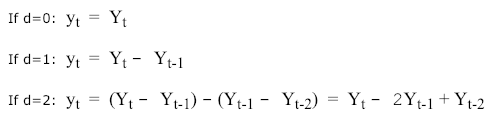
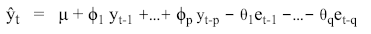

# ARIMA：Auto-Regressive Integrated Moving Average

## Introduction
-  A random variable that is a time series is **stationary** if its statistical properties are all constant over time.  A stationary series has no trend, its variations around its mean have a constant amplitude, and it wiggles in a consistent fashion.
- Lags of the stationarized series in the forecasting equation are called "autoregressive" terms, lags of the forecast errors are called "moving average" terms, and a time series which needs to be differenced to be made stationary is said to be an "integrated" version of a stationary series.

## [non-seasonal ARIMA model](http://people.duke.edu/~rnau/arimrule.htm)
- ARIMA(p,d,q)
    - p is the number of autoregressive terms
    - d is the number of nonseasonal differences needed for stationarity, and
    - q is the number of lagged forecast errors in the prediction equation.
    
    
[Summary of rules for identifying ARIMA models]

## [Box-Jenkuns medthodology](https://math.unice.fr/~frapetti/CorsoP/Chapitre_5_IMEA_1.pdf)
- Identify d, seasonality, p and q
- Estimation and information criteria
- Diagnostic checking

Reference:\
[ARIMA model](https://people.duke.edu/~rnau/411arim.htm)